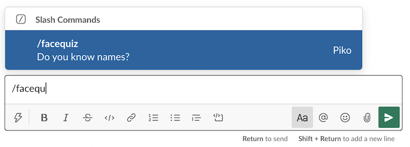

# Slack-bot starter

A starter for creating your own Slack bot using [Bolt](https://github.com/slackapi/bolt-js).

> With an example face quiz slash command.



**Related links**

- [Slack: BoltJS Getting started](https://slack.dev/bolt-js/)
- [Slack: Create an App](http://api.slack.com/apps)
- [Slack: Block Kit builder](https://app.slack.com/block-kit-builder/)

[](https://heroku.com/deploy)

## Adding to Slack

Follow these steps to set up this bot on your Slack

1. Deploy this repository to a server.
   Note down the public URL, e.g. `example.herokuapp.com`

2. Go to [api.slack.com/apps](https://api.slack.com/apps?new_app=1), and create a new App.

3. This app comes with a command `/facequiz`, that will quiz you on DM about names and faces
   of the users in your Slack. To enabled this, we need to.

   - **Go to Slash Commands** and create a new command.
   - The command must match our code, so enter `/facequiz` here
   - For the URL, enter your domain, followed by `/slack/events`.
     _E.g.`https://example.herokuapp.com/slack/events`_
   - Add some description and save.

   We'll need permissions to find users and their avatars, as well as
   send chat messages:

   - Go to _OAuth and Permissions_ in the left menu
   - Add scope `users:read` and `chat:write`

   For our bot to be able to respond to interactive messages, we must enable
   interactivity:

   - Go to _Interactivity and Shortcuts_, and enable it.
   - For the request url, we use the same as previously, e.g.
     `https://example.herokuapp.com/slack/events`

   We need Slack auth keys to be added. We do this by setting environment
   variables on the server we set up in step 1:

   - `SLACK_SIGNING_SECRET`: Found in _Basic Information_ -> _Signing Secret_
   - `SLACK_BOT_TOKEN`: Found in _Oath and Permissions_ -> _Bot User OAuth Access Token_

## Develop

Follow these instruction when you wish to develop the bot
further.

### Run bot locally

Slack needs a public URL to communicate with yout bot.
If you have set up a server running the bot, you _can_ skip this
section, and test directly by pushing the code to your server.

Having the bot running locally does however provide quicker feedback,
and is recommended.

#### Set up public URL tunnel (using ngrok)

You can use any method to have your localhost accessable publicly.
One solution is to use [ngrok](https://dashboard.ngrok.com/get-started/setup):

```
brew install ngrok
```

Authenticate and find your ngrok auth token at [ngrok setup](https://dashboard.ngrok.com/get-started/setup).

```
ngrok authtoken [YOUR-AUTH-TOKEN]
```

Get a public url forwarded to your port:

```
ngrok http 3000
```

#### Change Slack configuration

The public url in front of your localhost will have to used instead of `https://example.herokuapp.com`
in the Slack bot configuration – See [Adding to Slack](#adding-to-slack) above and change to your ngrok url.

#### Set up auth locally

Get auth keys from the section [Adding to Slack](#adding-to-slack),
and set them in the `.env` file:

```
cp .env.example .env
```

#### Install dependencies

```
yarn
```

#### Run bot

```
yarn start
```

Your local bot should now respond from Slack!
